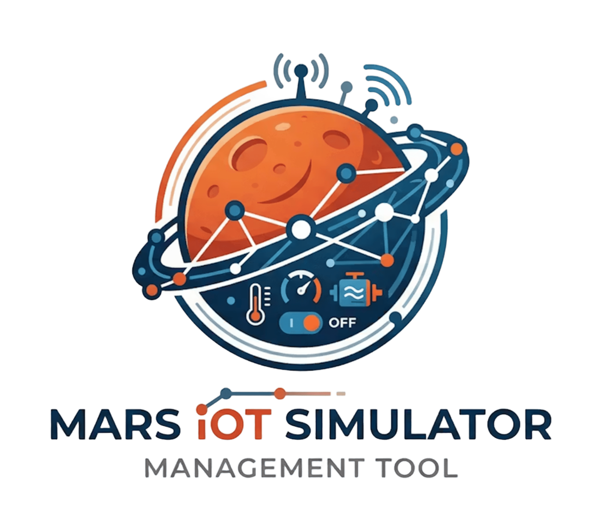

# Mars IoT Automation Platform

<p align="center">
  
</p>

A distributed event-driven platform for monitoring and automating a simulated Martian habitat. It ingests heterogeneous sensor data, normalizes events, evaluates automation rules, and exposes a real-time dashboard. 

## Stack

- Python + FastAPI
- Vue.js
- Kafka
- Redis
- PostgreSQL
- Docker 

## Run

```bash
docker load -i mars-iot-simulator-oci.tar
docker compose up --build

Simulator:
`https://drive.google.com/file/d/14Cou8XBTD-le7Gb9OHVjSJnf4tqa-aGn/view?usp=sharing`
